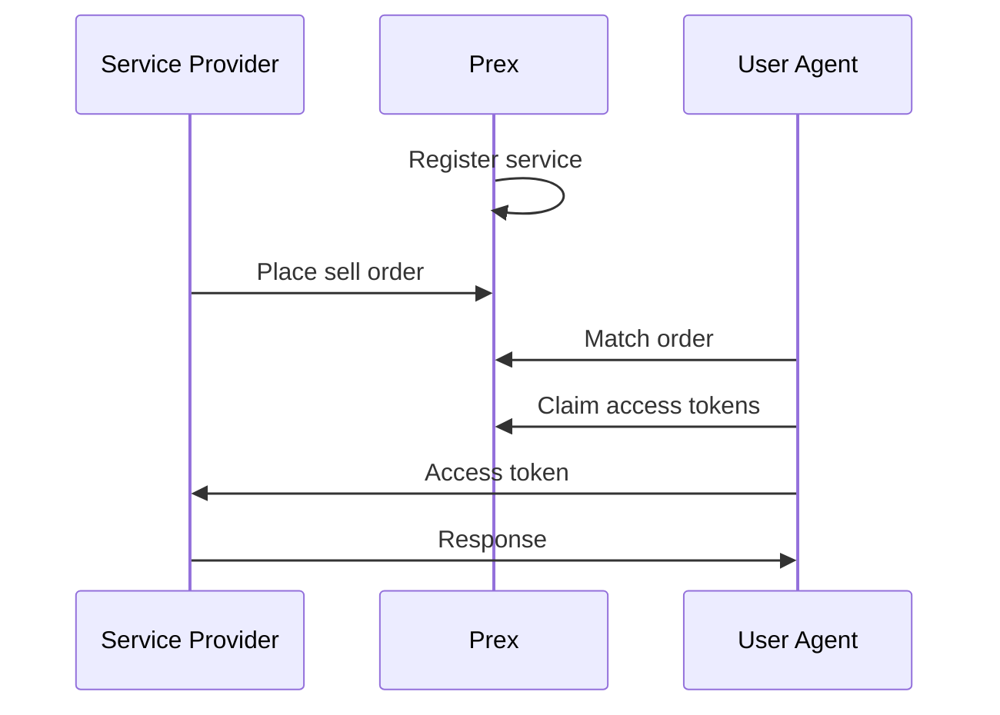

# Prex

> [!WARNING]
> Disclaimer: Prex is not ready for production usage yet. Use at your own risk. API is also subject to change.

[](https://github.com/atticplaygroup/prex/actions/workflows/verify-generated-code.yml)
[](https://github.com/atticplaygroup/prex/actions/workflows/run-unit-tests.yml)
[](https://github.com/atticplaygroup/prex/actions/workflows/run-api-tests.yml)

## What is Prex

Prex (PAID Request EXchange) facilitates the matching of client requests with [PAID (Permissionless Autonomous Incentivized Decoupled)](overview/paid-service.md) services, aiming to establish an [efficient market](https://www.investopedia.com/terms/e/efficientmarkethypothesis.asp) for requests and services through a [limit order book](https://en.wikipedia.org/wiki/Central_limit_order_book). It seeks to offer a monetization model that is an alternative or complement of advertisement-based revenue generation for contemporary Internet businesses.

Read more in the [documentation](https://github.com/atticplaygroup/prex/wiki/Home#what-is-prex).

PAID service examples include:

| Service | Description |
| - | - |
| [Pkv](https://github.com/atticplaygroup/pkv) | Key-Value Storage |

## Installation

```bash
go install github.com/atticplaygroup/prex@latest
```

## Usage

Documentation is available in [the wiki page](https://github.com/atticplaygroup/prex/wiki).

### Prex Operator

First set the environment variables
```bash
cp .env.example .env
# Modify as your needs
```

Start the gRPC server is as simple as 
```bash
prex server start
```

Optionally, start a RESTful JSON gateway
```bash
prex server gateway
```

To test it is running
```bash
curl http://localhost:3000/v1/ping | jq
```
A successful response will return a JSON object.
```json
{
  "pong": "pong"
}
```

### Service Provider and User

Prex is an exchange for access tokens (aka quota). Administrators first register what services it provide, like chatbots, content serving. Service providers then place sell orders for access tokens for their server instances. Users buy access tokens by matching the sell orders. Finally users claim JWT tokens from Prex and use them to access services.



Follow the [quickstart guide](https://github.com/atticplaygroup/prex/wiki/getting-started) for an example of echo server exchanged on Prex and made PAID.

## Further Reading

- Read the [quickstart guide](https://github.com/atticplaygroup/prex/wiki/getting-started) to see what Prex can do.  
- Read about [the motivation behind PAID services](https://github.com/atticplaygroup/prex/wiki/paid-service).
- Compare PAID services [with related technologies](https://github.com/atticplaygroup/prex/wiki/design-decisions).

## License

[Apache 2.0](./LICENSE)

